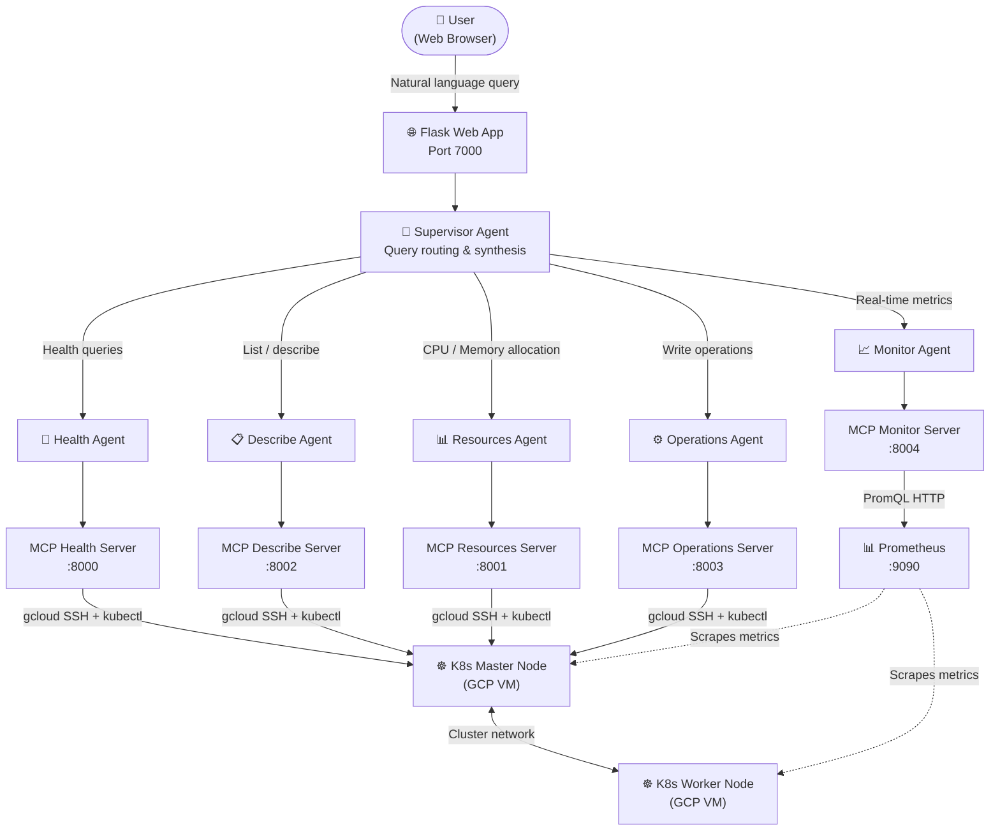

# K8s AI Dashboard

> Talk to your Kubernetes cluster in plain English. No `kubectl` required.

---

## Table of Contents

- [Overview](#overview)
- [Architecture](#architecture)
- [How It Works](#how-it-works)
- [Agent Responsibilities](#agent-responsibilities)
- [What Can It Do](#what-can-it-do)
- [Tech Stack](#tech-stack)
- [Prerequisites](#prerequisites)
- [Installation](#installation)
- [Configuration](#configuration)
- [Running the App](#running-the-app)
- [Example Queries](#example-queries)
- [Project Structure](#project-structure)

---

## Overview

K8s AI Dashboard is a web application that lets you manage and monitor Kubernetes clusters using natural language. You type a question or instruction, and the system executes the right `kubectl` or Prometheus commands against your real cluster and returns a clear, synthesized answer.

**Before this:** Open a terminal → remember the right `kubectl` subcommand → get the flags right → parse the output → repeat for every domain (nodes, pods, metrics, operations).

**With this:** Type *"Which pods are using the most memory right now?"* or *"Scale nginx to 5 replicas"* in a browser and get an answer.

Under the hood, **five specialized AI agents** each own a specific domain. A **Supervisor Agent** classifies every query, fans it out to the right agents in parallel, and merges the results into one response.

---

## Architecture



---

## How It Works

1. **User** sends a question via the browser UI on port 7000.
2. **Supervisor Agent** classifies the query and breaks it into sub-tasks for the right agents.
3. **Specialist agents** run in parallel — LangGraph handles concurrency.
4. Each agent calls its dedicated **MCP server** over HTTP to execute tools (`kubectl`, PromQL).
5. MCP servers connect to the K8s master node via `gcloud compute ssh` and run commands.
6. **Supervisor** merges all agent responses and returns a single coherent answer to the UI.

---

## Agent Responsibilities

| Agent | Owns | Backend |
|---|---|---|
| **Health Agent** | Node readiness, pod crash loops, cluster events, control plane status | MCP Health Server `:8000` |
| **Describe Agent** | List / describe / count any K8s resource, pod status | MCP Describe Server `:8002` |
| **Resources Agent** | CPU & memory requests, limits, node allocatable capacity | MCP Resources Server `:8001` |
| **Monitor Agent** | Real-time Prometheus metrics, top-N pods, usage trends | MCP Monitor Server `:8004` |
| **Operations Agent** | Scale, restart, delete, drain, cordon, rollback, apply YAML | MCP Operations Server `:8003` |
| **Supervisor Agent** | Query routing, parallel orchestration, response synthesis | Coordinates all agents |

---

## What Can It Do

| Category | Example queries |
|---|---|
| Cluster health | "Are all nodes healthy?" · "Any pods in CrashLoopBackOff?" · "Show recent warnings" |
| Resource discovery | "List all deployments in kube-system" · "How many pods are running?" |
| Capacity planning | "What's the allocatable CPU across all nodes?" · "Which pod has the highest memory limit?" |
| Real-time metrics | "Which pod is using the most memory right now?" · "Show CPU trend for the last hour" |
| Write operations | "Scale nginx to 3 replicas" · "Restart the api deployment" · "Delete all failed pods" |
| Node maintenance | "Drain the worker node" · "Cordon k8s-worker-01" |

---

## Tech Stack

| Layer | Technology |
|---|---|
| Web framework | Flask + Flask-Login |
| AI model | Claude (Anthropic) |
| Agent framework | LangGraph + LangChain |
| Tool protocol | MCP (Model Context Protocol) via FastMCP |
| Cluster access | `gcloud compute ssh` + `kubectl` |
| Metrics | Prometheus + PromQL |
| Database | SQLite (user auth) |

---

## Prerequisites

- Python **3.10+**
- A running Kubernetes cluster reachable via `gcloud compute ssh`
- Google Cloud SDK (`gcloud`) authenticated and configured
- Prometheus with `node_exporter` deployed on cluster nodes (required for real-time metrics)
- An Anthropic API key

---

## Installation

```bash
git clone <repo-url>
cd app2.0

python3 -m venv .venv
source .venv/bin/activate

pip install -r requirements.txt
```

---

## Configuration

Create a `.env` file in the `app2.0/` directory. All values below are required:

```env
ANTHROPIC_API_KEY=your_claude_api_key
PROMETHEUS_URL=http://<prometheus-ip>:9090
K8S_MASTER_ZONE=us-central1-a
K8S_MASTER_INSTANCE=k8s-master-001
GCLOUD_SSH_USER=your_gcp_username
SECRET_KEY=your_flask_secret_key
```

> Never commit `.env` to version control. Add it to `.gitignore`.

---

## Running the App

`startup.sh` manages all processes (Flask + 5 MCP servers):

```bash
cd app2.0
bash startup.sh start     # Start everything
bash startup.sh status    # Check what is running
bash startup.sh stop      # Stop everything
bash startup.sh restart   # Restart all services
```

Services started:

| Service | Port |
|---|---|
| Flask web app | 7000 |
| MCP Health Server | 8000 |
| MCP Resources Server | 8001 |
| MCP Describe Server | 8002 |
| MCP Operations Server | 8003 |
| MCP Monitor Server | 8004 |

Open `http://localhost:7000` in your browser.

---

## Example Queries

**Health & Status**
```
Are all nodes healthy?
Are there any pods in CrashLoopBackOff?
Show recent cluster warnings
```

**Resource Discovery**
```
How many pods are running in the cluster?
List all deployments in kube-system
Show the YAML for the nginx deployment
```

**Capacity & Allocation**
```
What's the allocatable CPU across all nodes?
Which pod has the highest memory limit?
Show resource requests and limits for all pods
```

**Real-time Metrics**
```
Which pod is using the most memory right now?
Show top 3 pods by CPU usage
What's the memory usage trend for the master node over the last hour?
```

**Operations**
```
Scale nginx deployment to 3 replicas
Restart the api deployment
Delete all failed pods
Drain the worker node for maintenance
Rollback the nginx deployment to the previous revision
```

---

## Project Structure

```
.
├── README.md               # You are here
│
└── app2.0/                 # Main application
    ├── app.py              # Flask application entry point
    ├── models.py           # SQLAlchemy user model (auth)
    ├── cli.py              # CLI helper commands
    ├── startup.sh          # Start / stop all services
    ├── requirements.txt
    ├── .env                # Local config (not committed)
    │
    ├── agents/             # LangGraph agent definitions
    │   ├── k8s_agent.py    # Supervisor agent
    │   ├── health_agent.py
    │   ├── describe_agent.py
    │   ├── resources_agent.py
    │   ├── monitor_agent.py
    │   └── operations_agent.py
    │
    ├── MCP/                # MCP server implementations
    │   ├── mcp_health/
    │   ├── mcp_describe/
    │   ├── mcp_resources/
    │   ├── mcp_operations/
    │   └── mcp_monitor/
    │
    └── pages/              # Additional Flask pages
        └── architecture.py
```
