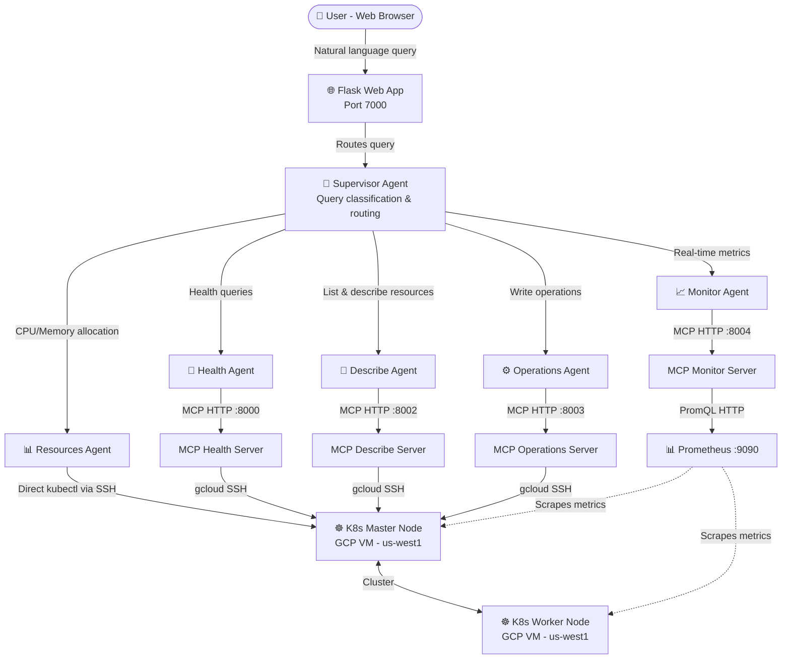

# K8s AI Dashboard

## What Is This?

K8s AI Dashboard is a web application that lets you manage and monitor Kubernetes clusters using plain English — no `kubectl` commands needed.

You open a browser, type a question like *"Which pods are using the most memory right now?"* or give an instruction like *"Scale the nginx deployment to 5 replicas"*, and the system figures out what to do, executes it against your real cluster, and returns a clear answer.

## Why Does This Exist?

Kubernetes is powerful but operationally heavy. On any given day, a developer or SRE might need to:

- Check why a pod keeps crashing
- Find which workload is eating all the memory
- Scale a deployment during high traffic
- Drain a node before maintenance
- Cross-reference real-time Prometheus metrics with kubectl resource states

Each of these requires different commands, flags, namespaces, and mental context switching. Mistakes happen. Things are forgotten.

This project replaces that friction with a single conversational interface. Under the hood, **5 specialized AI agents** each own a domain (health, resources, real-time metrics, operations, resource listing). When you ask a question, a **Supervisor Agent** routes it to the right agents, runs them in parallel, and synthesizes the results into one coherent answer.

## What Can It Do?

| Category | Example |
|---|---|
| Cluster health | "Are all nodes healthy?" / "Any pods in CrashLoopBackOff?" |
| Resource discovery | "List all deployments in kube-system" / "How many pods are running?" |
| Capacity planning | "What's the allocatable CPU across all nodes?" / "Which pod has the highest memory limit?" |
| Real-time monitoring | "Which pod is using the most memory right now?" / "Show CPU usage trend for the last hour" |
| Write operations | "Scale nginx to 3 replicas" / "Restart the api deployment" / "Delete all failed pods" |
| Node maintenance | "Drain the worker node" / "Cordon k8s-worker-01" |

---

## Architecture



### How It Works

1. User sends a question via the web UI
2. **Supervisor Agent** classifies the query and routes sub-questions to the right agents
3. Relevant **specialist agents** run in parallel (up to 5 simultaneously)
4. Each agent calls its **MCP server** via HTTP to execute kubectl/Prometheus tools
5. MCP servers SSH into the K8s master node to run `kubectl` commands
6. Supervisor synthesizes all agent responses into one answer

### Agent Responsibilities

| Agent | Domain | Backend |
|---|---|---|
| Health Agent | Node health, cluster events, control plane status | MCP Health Server (8000) |
| Describe Agent | List/describe/count any K8s resource, pod status | MCP Describe Server (8002) |
| Resources Agent | CPU/memory requests, limits, node capacity | Direct kubectl via SSH |
| Monitor Agent | Real-time Prometheus metrics, trends, top-N queries | MCP Monitor Server (8004) |
| Operations Agent | Scale, restart, delete, drain, rollback, apply YAML | MCP Operations Server (8003) |
| Supervisor Agent | Query routing and response synthesis | Orchestrates above agents |

---

## Setup

### Prerequisites

- Python 3.10+
- A running Kubernetes cluster accessible via `gcloud compute ssh`
- Prometheus with `node_exporter` on cluster nodes (for real-time metrics)
- Google Cloud SDK (`gcloud`) configured with access to the cluster project

### Installation

```bash
git clone <repo-url>
cd app2.0
python3 -m venv .venv
source .venv/bin/activate
pip install -r requirements.txt
```

### Configuration

Create a `.env` file in the `app2.0/` directory:

```env
ANTHROPIC_API_KEY=your_claude_api_key
PROMETHEUS_URL=http://<prometheus-ip>:9090
K8S_MASTER_ZONE=us-west1-a
K8S_MASTER_INSTANCE=k8s-master-01
GCLOUD_SSH_USER=your_gcp_username
SECRET_KEY=your_flask_secret_key
```

### Start the Application

```bash
bash startup.sh start
```

This starts:
- Flask web app on port **7000**
- MCP Health Server on port **8000**
- MCP Resources Server on port **8001**
- MCP Describe Server on port **8002**
- MCP Operations Server on port **8003**
- MCP Monitor Server on port **8004**

```bash
bash startup.sh status   # Check all services
bash startup.sh stop     # Stop everything
bash startup.sh restart  # Restart all services
```

Open `http://localhost:7000` in your browser.

---

## Example Queries

**Health & Status**
- "Are all nodes healthy?"
- "Are there any pods in CrashLoopBackOff?"
- "Show recent cluster warnings"

**Resource Discovery**
- "How many pods are running in the cluster?"
- "List all deployments in kube-system"
- "Show YAML for the nginx deployment"

**Capacity & Allocation**
- "What's the allocatable CPU across all nodes?"
- "Which pod has the highest memory limit?"
- "Show resource requests and limits for all pods"

**Real-time Metrics**
- "Which pod is using the most memory right now?"
- "Show top 3 pods by CPU usage"
- "What's the memory usage trend for the master node over the last hour?"

**Operations**
- "Scale nginx deployment to 3 replicas"
- "Restart the api deployment"
- "Delete all failed pods"
- "Drain the worker node for maintenance"
- "Rollback the nginx deployment to the previous revision"

---

## Tech Stack

- **Frontend**: Flask + HTML/CSS/JS
- **AI Model**: Claude (Anthropic) via LangChain
- **Agent Framework**: LangGraph
- **Tool Protocol**: MCP (Model Context Protocol) via FastMCP
- **Cluster Access**: `gcloud compute ssh` + `kubectl`
- **Metrics**: Prometheus + PromQL
- **Auth**: Flask-Login with SQLite
